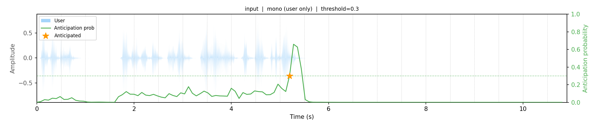

# Endpoint Anticipation for Low-Latency Spoken Dialogue

**Interspeech 2026** | [Paper (arXiv)](https://arxiv.org/abs/2606.13450) | [Model Weights (HuggingFace)](#model-weights)

> Sathvik Udupa, Shinji Watanabe, Petr Schwarz, Jan Cernocky



---

## System in Action

The following example is from [Full Duplex Bench v1](https://github.com/DanielLin94144/Full-Duplex-Bench), sample `candor_turn_taking/1`. The user asks: *"10 companies that let you teach English online without a..."*

**Baseline (VAD only)** — LLM and TTS only start after end-of-turn is detected; bot audio is delayed by the full LLM+TTS processing time:


**With endpoint anticipation** — the model fires speculatively 3 times as the transcript grows, each time refining the response. The third speculation (starting at 4.64s, on transcript *"...teach English"*) is committed when VAD confirms at 6.0s. Bot audio was already buffered **0.64s before** the turn ended:


| Time | Transcript so far | Speculative response | Outcome |
|------|------------------|----------------------|---------|
| 2.56s | *"10 companies."* | "...1. Apple 2. Microsoft..." | discarded |
| 3.60s | *"...That let you teach"* | "...1. Duolingo 2. Khan Academy..." | discarded |
| 4.64s | *"...That let you teach English"* | "...1. Cambly 2. italki 3. Verbling 4. Preply..." | **committed** ✓ |
| 6.00s | VAD fires | Committed audio replayed; continuation LLM first token at 6.32s | |

See [`unmute-integration/samples/`](unmute-integration/samples/) for the audio and full timings JSON.

---

## Overview

Cascaded spoken dialogue systems are bottlenecked by **reactive** end-of-turn detection: the system waits for the user to finish speaking before invoking the LLM or TTS pipeline. This repository contains the code for **Endpoint Anticipation** — a shift from reactive detection to **proactive forecasting** of end-of-turn signals from speech audio.

```
  Traditional (reactive)                This work (anticipatory)
  ──────────────────────                ────────────────────────
  User speaks ──► [end] ──► LLM ──►    User speaks ──► [predicted end - Δt] ──► LLM (speculative)
                                                               │
                                              realised latency reduction: ~505 ms
```

The anticipation model predicts end-of-turn **up to 2.56 seconds in advance**, enabling speculative execution of LLM and TTS pipelines on partial context. This effectively masks sequential bottlenecks and enables complex reasoning in real-time speech-to-speech interaction.

Key results on the [Unmute](https://github.com/kyutai-labs/unmute) framework:
- **505 ms** average latency reduction
- Consistently outperforms VAP-based baselines across conversational and task-oriented datasets

---

## Repository Structure

```
EndpointAnticipation/
├── anticipation-model/     # Speech-based endpoint anticipation model
└── unmute-integration/     # Integration with the Unmute spoken dialogue framework
```

### Part 1 — Anticipation Model (`anticipation-model/`)

A streaming, speech-based causal transformer model built on neural audio codec (NAC) representations. It outputs a probability of anticipating an end-of-turn at a defined horizon, at each frame.

- Supports dual-stream (separate user/system audio) configurations
- See [`anticipation-model/README.md`](anticipation-model/README.md) for training, data preparation, and inference details.

### Part 2 — Unmute Integration (`unmute-integration/`)

A modified version of the [Unmute](https://github.com/kyutai-labs/unmute) real-time speech-to-speech framework that adds the anticipation model and orchestration. When the anticipation model fires, the system speculatively invokes the LLM on partial user context. If the prediction is correct, the response is ready earlier; if incorrect, the speculative result is cached. The final generation is played only at the actual end of turn.

- Includes evaluation scripts for measuring realized latency reduction 
- See [`unmute-integration/README.md`](unmute-integration/README.md) for setup and usage.

---

## Model Weights

Pre-trained model checkpoints are available on HuggingFace:

> **[viks66/endpoint-anticipation](https://huggingface.co/viks66/endpoint-anticipation)**

## Citation

If you use this work, please cite:

```bibtex
@inproceedings{udupa2026endpoint,
  title     = {Endpoint Anticipation for Low-Latency Spoken Dialogue},
  author    = {Udupa, Sathvik and Watanabe, Shinji and Schwarz, Petr and Cernocky, Jan},
  booktitle = {Interspeech},
  year      = {2026},
  url       = {https://arxiv.org/abs/2606.13450}
}
```

---

## TODO

- [x] Anticipation model codebase
- [x] Anticipation model README
- [x] Unmute integration codebase
- [x] Unmute integration README
- [x] Model checkpoints (HuggingFace)

---

## Contact

For questions, feel free to open an issue or reach out to `sathvikudupa66@gmail.com`.
