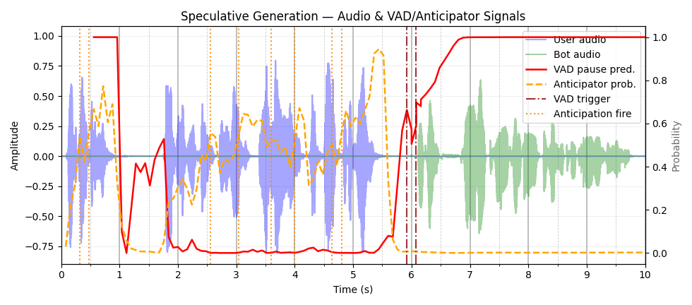

# Unmute Integration

Integration of the endpoint anticipation model into [Unmute](https://github.com/kyutai-labs/unmute), Kyutai's open-source spoken dialogue system. The anticipator runs as a dedicated inference server alongside STT, TTS, and LLM, enabling speculative LLM execution that starts responding before the user finishes speaking.

## Architecture

```
User audio ──► STT (moshi-server :8090)
               │
               ▼
           Unmute handler ──► Anticipator (:8093)
               │                    │
               │         anticipation fires early
               │                    │
               ▼                    ▼
           LLM  (vLLM :8091) ◄── speculative generation starts
               │                 (discarded if user keeps talking,
               ▼                  committed when VAD confirms)
           TTS (moshi-server :8089)
```

## Setup

### Services

Start each service in a separate terminal from the `dockerless/` directory:

```bash
bash dockerless/start_stt.sh          # STT on :8090
bash dockerless/start_tts.sh          # TTS on :8089
bash dockerless/start_llm.sh          # vLLM (Gemma 3 1B) on :8091
bash dockerless/start_anticipator_v2.sh  # Anticipator on :8093
```

The anticipator downloads the checkpoint from [`viks66/endpoint-anticipation`](https://huggingface.co/viks66/endpoint-anticipation) automatically on first run.

### Offline evaluation on Full Duplex Bench v1

```bash
# Point to your local copy of Full Duplex Bench v1
export FDB_DATA=/path/to/Full-Duplex-Bench-Data

# Run with endpoint anticipation (speculative mode)
bash infer_fdb.sh
```

Set `instruction_type=smalltalk_no_starter` in `infer_fdb.sh` for the VAD baseline (no anticipation).

## Example

The plot and audio in `samples/` are from [Full Duplex Bench v1](https://github.com/DanielLin94144/Full-Duplex-Bench), sample `candor_turn_taking/1`.



The user asks: *"10 companies that let you teach English online without a..."* (transcript builds incrementally).

`samples/example_timings.json` records the full speculation trace. The key sequence:

| Time | Event | Transcript available | Speculated response |
|------|-------|---------------------|---------------------|
| 2.56s | Anticipation fires (p=0.56) | *"10 companies."* | "Okay, here are 10 companies: 1. Apple 2. Microsoft..." — **discarded** (user still speaking) |
| 3.60s | Anticipation fires (p=0.53) | *"10 companies. That let you teach"* | "...companies that let you teach: 1. Duolingo 2. Khan Academy..." — **discarded** |
| 4.64s | Anticipation fires (p=0.50) | *"10 companies. That let you teach English"* | "...teach English: 1. Cambly 2. italki 3. Verbling 4. Preply..." — **committed** ✓ |
| 6.00s | VAD confirms end-of-turn | Full transcript | Committed speculation replayed; continuation LLM extends from token 1 at 6.32s |

The bot's first audio chunk was ready at **5.36s** — 0.64s before VAD triggered at 6.0s. From the user's perspective the response begins at turn end with no perceptible latency, because the speculative audio was already buffered and waiting.
