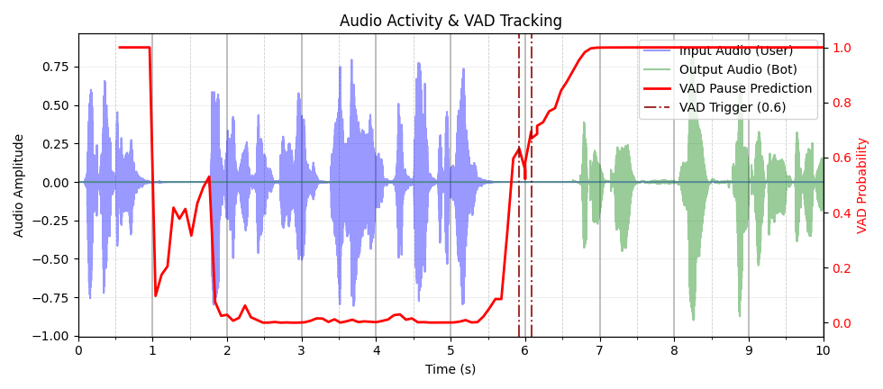

# Unmute Integration

This directory builds on top of [Unmute](https://github.com/kyutai-labs/unmute), Kyutai's open-source real-time spoken dialogue framework. Unmute provides high-quality, production-ready components that we use without modification: the **moshi-server STT** (streaming ASR), **moshi-server TTS** (neural text-to-speech), and **VAD** (voice activity detection, used to decide when to commit a speculative response to the user). These components are excellent as-is.

### Contributions in this work

**1. Endpoint anticipation model** (`../anticipation-model/`) — a streaming causal transformer over neural audio codec features that predicts end-of-turn probability at each 80 ms frame, up to 2.56 s in advance.

**2. Speculative orchestration** (`unmute/unmute_handler_speculative.py`) — when the anticipator fires above a threshold during the user's turn, the system immediately launches a speculative LLM call on the partial transcript and pipes its output into a speculative TTS stream. The speculative audio is buffered in a cache. If the user keeps speaking, the anticipation window expires, the speculation is discarded, and a new one may be launched on the updated transcript. When VAD finally confirms the end of turn, the committed speculation is replayed to the user — with no additional LLM or TTS latency.

**3. Continuation generation** — after committing the speculative prefix, a second LLM call runs on the full final transcript and continues generating from where the speculative response left off. Crucially, the continuation TTS resumes from the **speculative TTS state**, ensuring prosodic continuity and natural-sounding speech across the prefix/continuation boundary.

**4. Offline evaluation** (`unmute/scripts/evaluate_recording.py`, `evaluate_recording_speculative.py`) — scripts to run Unmute and Unmute+Anticipation on pre-recorded audio files for reproducible latency benchmarking, used to produce the results in the paper.

## Architecture

```
User audio ──► STT  (moshi-server :8090)  ←── Kyutai Unmute (unchanged)
               │           VAD ──────────────────────────────┐
               ▼                                             │ (commit / discard)
           Unmute handler ──► Anticipator (:8093)            │
               │                    │                        │
               │         anticipation fires                  │
               │                    │                        │
               ▼                    ▼                        │
           LLM (vLLM :8091) ◄── speculative LLM starts      │
               │                   │                         │
               ▼                   ▼                         │
           TTS (moshi-server :8089) ◄── speculative TTS ─────┘
                                        (state preserved for
                                         natural continuation)
```

## Setup

### Services

Start each service in a separate terminal from the `dockerless/` directory:

```bash
bash dockerless/start_stt.sh          # STT on :8090
bash dockerless/start_tts.sh          # TTS on :8089
bash dockerless/start_llm.sh          # vLLM (Gemma 3 1B) on :8091
bash dockerless/start_anticipator_v2.sh  # Anticipator on :8093
```

The anticipator downloads the checkpoint from [`viks66/endpoint-anticipation`](https://huggingface.co/viks66/endpoint-anticipation) automatically on first run.

### Offline evaluation on Full Duplex Bench v1

```bash
# Point to your local copy of Full Duplex Bench v1
export FDB_DATA=/path/to/Full-Duplex-Bench-Data

# Run with endpoint anticipation (speculative mode)
bash infer_fdb.sh
```

Set `instruction_type=smalltalk_no_starter` in `infer_fdb.sh` for the VAD baseline (no anticipation).

## Example

Plots and audio in `samples/` are from [Full Duplex Bench v1](https://github.com/DanielLin94144/Full-Duplex-Bench), sample `candor_turn_taking/1`. The user asks: *"10 companies that let you teach English online without a..."*

**Baseline (VAD only)** — bot audio starts only after VAD triggers and LLM+TTS complete:



**With endpoint anticipation** — speculative LLM+TTS run during the user's turn; committed audio is already buffered when VAD fires:


`samples/example_timings.json` records the full speculation trace. The key sequence:

| Time | Event | Transcript available | Speculated response |
|------|-------|---------------------|---------------------|
| 2.56s | Anticipation fires (p=0.56) | *"10 companies."* | "...1. Apple 2. Microsoft..." — **discarded** (user still speaking) |
| 3.60s | Anticipation fires (p=0.53) | *"10 companies. That let you teach"* | "...1. Duolingo 2. Khan Academy..." — **discarded** |
| 4.64s | Anticipation fires (p=0.50) | *"10 companies. That let you teach English"* | "...1. Cambly 2. italki 3. Verbling 4. Preply..." — **committed** ✓ |
| 6.00s | VAD confirms end-of-turn | Full transcript | Committed audio replayed; continuation LLM first token at 6.32s |

The bot's first audio chunk was ready at **5.36s** — 0.64s before VAD triggered at 6.0s. Compared to the baseline where LLM and TTS only start after VAD, the speculative response begins with no perceptible latency.

## Early Triggers and Expected Redundant Computation (ERC)

As with any turn-taking system, the anticipation model can fire early — triggering speculative generation that is subsequently discarded because the user keeps speaking. This is especially common on **long turns** where sub-utterances are grammatically complete in themselves (e.g. *"10 companies."* looks like a full turn before the user continues *"...that let you teach English online"*). The example above illustrates this: two of the three speculation attempts were discarded.

Early triggers are not failures — discarded speculations are cheap relative to the latency savings when a prediction is correct. However, they do represent redundant LLM and TTS computation. The paper introduces **Expected Redundant Computation (ERC)** to quantify this trade-off: the expected number of speculative tokens generated per turn that are ultimately discarded. ERC can be measured independently using only the anticipation model and a labelled dataset, without running the full dialogue system — see the `anticipation-model/` evaluation for details.
